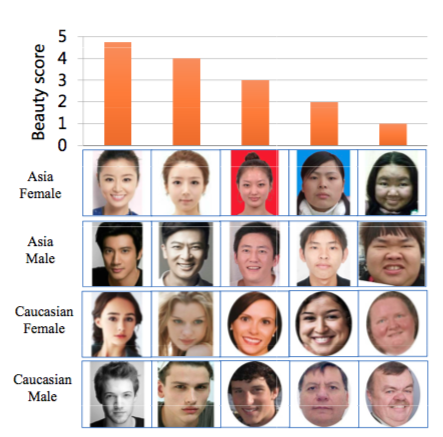
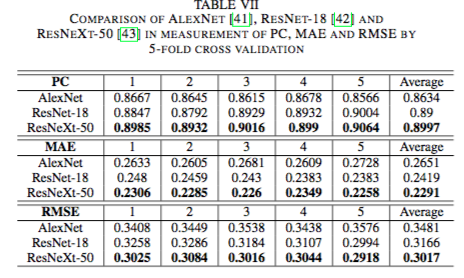
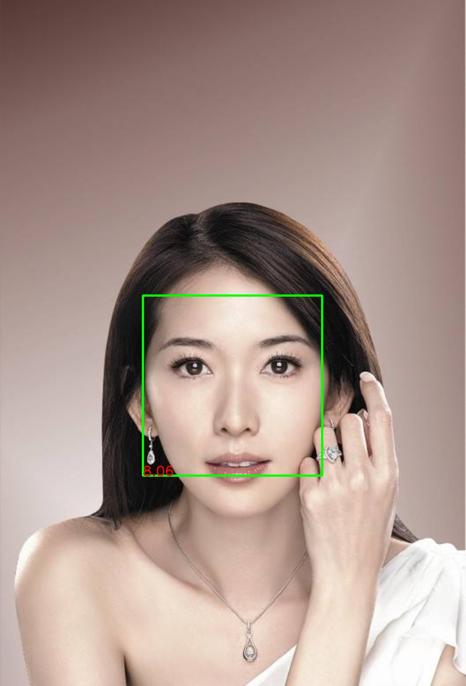
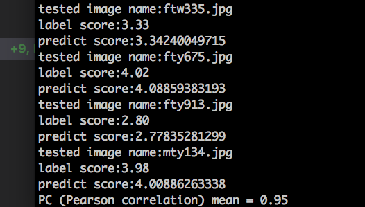

# BeautyPredict

Facial beauty prediction via deep learning methods based on SCUT-FBP5500 dataset described in the paper [1] and [2]，which listed at the end of this article, have been partially implemented in this project.

The SCUT- FBP5500 dataset has totally 5500 frontal faces with diverse properties (male/female, Asian/Caucasian, ages) and diverse labels (face landmarks, beauty scores within [1, 5], beauty score distribution), which allows different computational models with different FBP paradigms.

Further more, three recently proposed CNN models with different structures for FBP, including AlexNet, ResNet-18 and ResNeXt-50, which are trained by initializing weights using networks pre-trained on the ImageNet dataset, have been evaluated on the dataset.

The results illustrates that the deepest CNN-based ResNeXt-50 model obtains the best performance. [The Pearson correlation coefficient](https://en.wikipedia.org/wiki/Pearson_correlation_coefficient) is 0.8997.

The second paper, recasts facial attractiveness computation as a label distribution learning problem and puts forward an end-to-end attractiveness learning framework. Extensive experiments are conducted on a standard benchmark, the SCUT-FBP dataset, where shows significant advantages over other state-of-the-art work.

I have trained Label distribution learning model based on ResNet fine-tuing, you could refer the paper to get detail infomation. The Pearson correlation coefficient is 0.95, which is tested on the SCUT-FBP5500 dataset.

## Dependency
1. Python 3.x
2. Tensorflow
3. Keras
4. numpy
5. opencv
6. h5py
7. dlib

## How to use
1. The trained model files could be downloaded via follow links:
- [Label distribution learning model](https://pan.baidu.com/s/1d6jBWNxy3eXS5tz3TvCwsw)

2. put Label distribution learning model under inference/ldl+resnet folder, and run beauty_predict.py

-----

If you want to train your own model, read the follow part.

## How to train
1. Prepare Data
- download [dataset](https://pan.baidu.com/s/1-mBxJgaDwgy02th9S0olMA), unzip and put it under Project Root folder
- cd train/ldl+resnet and run prepare_data.py to prepare data before training label distribution learning model

2. Train and test 
- run train_model.py under train/ldl+resnet folder, this maybe take a long while, which depends on your machine. The model file named model-ldl-resnet.h5 will be generated in the same folder.
- run test_model.py script, which will test the model on test dataset, and print the label score and predict score for each image in the test dataset, finally the [The Pearson correlation coefficient](https://en.wikipedia.org/wiki/Pearson_correlation_coefficient) has been listed in the last line.

3. Predict
- copy the model file nameed model-ldl-resnet.h5 to inference/ldl+resnet folder, you could call beauty_predict.py to use the model now.

## References
1. [SCUT-FBP5500 A Diverse Benchmark Dataset for Multi-Paradigm Facial Beauty Prediction](https://arxiv.org/abs/1801.06345)
2. [Label Distribution Based Facial Attractiveness Computation by Deep Residual Learning](https://arxiv.org/abs/1609.00496)